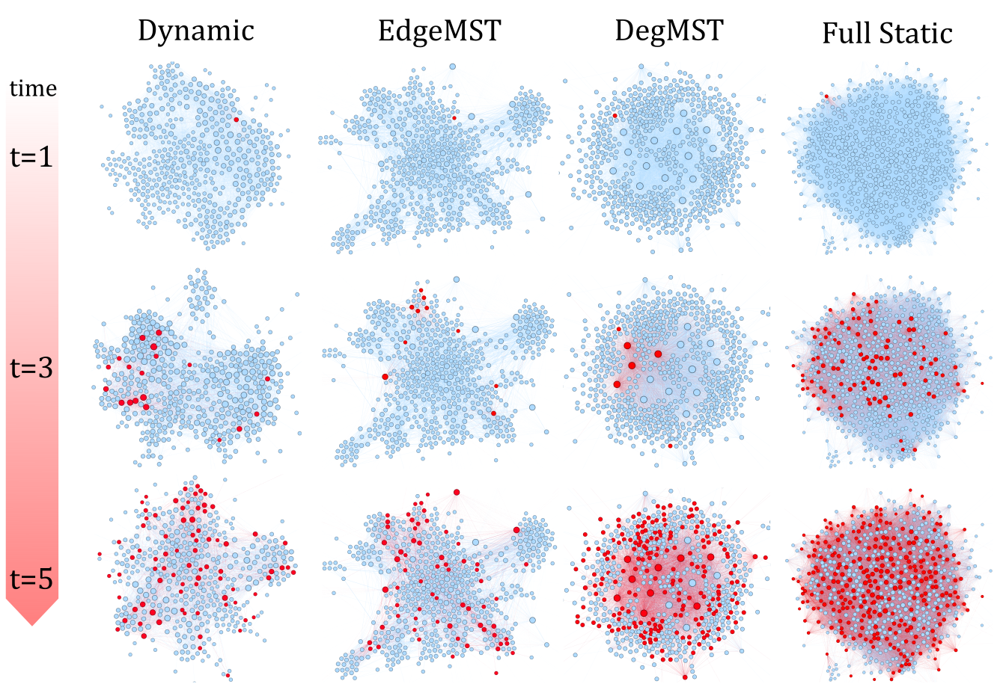

## EdgeMST and DegMST
Official python implementation of our paper: 

**Static Graph Approximations of Dynamic Contact Networks for Epidemic Forecasting**




## Usage
All experiments from the paper can be reproduced here

1. download dataset

2. run experiment


```
python main.py
```

## Datasets

Add dataset instruction here


## Installation

```
I am python instruction
```


## Dependency

```
Python 3.9
```

## Contact:

For any questions or inquiries, please reach out by [email](shenyang.huang@mail.mcgill.ca).

